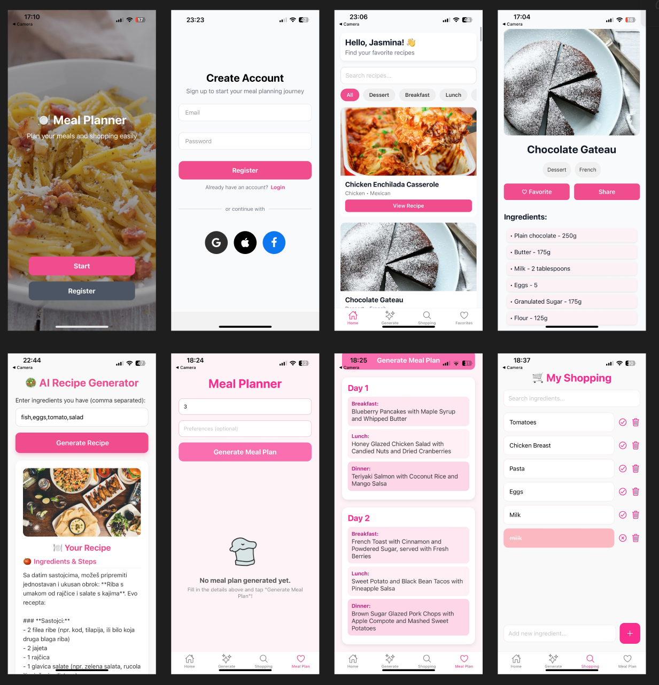

# Meal Planner – React Native App

Meal Planner is a mobile application built with React Native that allows users to search, filter, and save recipes, generate AI-based recipes and meal plans, and manage a personal shopping list.  
The app uses Firebase for authentication and database management, and Zustand for state management.

---

## Features

### Authentication
- User registration and login via Firebase Authentication  
- User data stored in Firestore

### Home Screen
- Displays popular recipes loaded from an external API  
- Allows searching and filtering recipes by name or category  
- Clicking on a recipe opens the Recipe Details Screen

### Recipe Details
- Displays recipe ingredients, instructions, and image  
- "Add to Favorites" button to save recipes  
- "Share" button for sharing recipes with others

### AI Recipe Generator
- User inputs available ingredients  
- Backend uses the Cohere AI API to generate a unique recipe  
- The generated recipe is displayed in the app

### AI Meal Plan Generator
- User enters the number of days and optional dietary preferences  
- The app generates a meal plan (breakfast, lunch, dinner) for each day  
- The output is formatted in JSON and displayed in the app

### Shopping List
- Create, edit, and delete shopping list items  
- Mark items as purchased / not purchased  
- List is stored locally or in Firestore

### Favorites
- View all saved favorite recipes  
- Remove favorites with a single click

---

## Technologies

### Frontend
- React Native (Expo)
- Expo Go – used for running and testing the app on mobile devices  
- Zustand – State management
- Firebase Auth + Firestore
- React Navigation
- Cohere API (AI text generation)
- Axios / Fetch API – API calls

### Backend
- Node.js + Express
- Cohere AI SDK
- dotenv – Environment variable management
- CORS – Enables cross-origin requests from the mobile app

---

## Project Structure

The project follows a modular feature-based structure.  
The main application code is located inside the `app/` directory, which contains the following folders:

- `tabs/` – main navigation tabs of the application  
- `features/` – organized by feature modules such as `home`, `auth`, `ai`, `favorites`, `shopping`, and `profile`  
- `store/` – Zustand stores for managing global state  
- `firebase/` – Firebase configuration and database setup  
- `assets/` – static files such as images and icons  

At the root level, there is also a `server/` folder that contains the backend built with Node.js and Express, responsible for handling AI-based recipe and meal plan generation through the Cohere API.

##  Screenshots

Here is an example of the app:

 More  screens are available on the following Figma link:  
[Figma Project Link](https://www.figma.com/design/6sQzlMvR4Bnss37lPkonwG/meal-planner?node-id=0-1&p=f&t=tLLmw9Je6bzMtb6Z-0)
